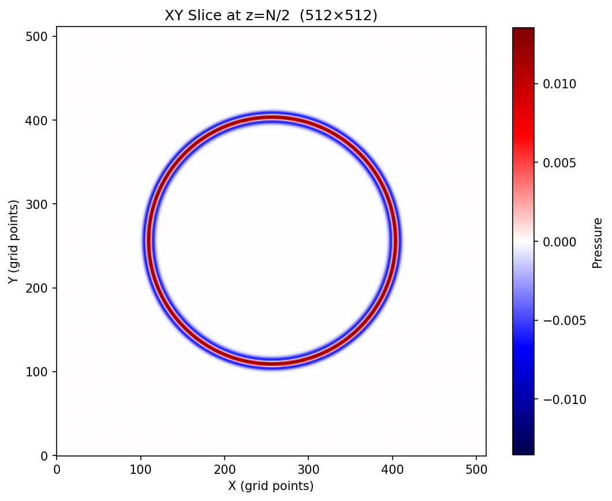

# Richter
**High-Performance GPU Seismic Wave Propagation Library**

A CUDA-optimized 3D Acoustic Wave Propagation engine built for Reverse Time Migration (RTM) and Full Waveform Inversion (FWI) workloads. Named after Charles F. Richter — because when it comes to seismic compute, magnitude matters.

Main Kernel is called Hello.cu, because its like a wave. Get it?

## Architecture

```
┌─────────────────────────────────────────────────┐
│  Python API  (NumPy ↔ PyBind11)                 │
├─────────────────────────────────────────────────┤
│  C++ Orchestrator  (model.cpp)                  │
│  Memory management, time-stepping, dispatch     │
├──────────┬──────────┬──────────┬────────────────┤
│  Naive   │  SHMem   │ RegRot   │  Triton (TBD) │
│  Kernel  │  2.5D    │ Sliding  │               │
│          │  Tiling  │ Window   │               │
└──────────┴──────────┴──────────┴────────────────┘
         CUDA Computational Backend
```

## Building

```bash
mkdir build && cd build
cmake .. -DCMAKE_CUDA_ARCHITECTURES=86
cmake --build . --config Release
```

## Running Tests

```bash
./build/runtests
```

## Benchmarking

```bash
# Default 256^3 grid
./build/benchmark

# Custom grid size and peak bandwidth (GB/s)
./build/benchmark 512 448.0
```

## Benchmark Results

Grid: 512^3 | GPU: RTX 3070

| Implementation | GPts/s | Effective BW | % Peak BW |
|----------------|--------|-------------|-----------|
| Devito (Auto-tuned) | — | — | — |
| Naive Kernel | 8.018 | 128.3 GB/s | 28.6% |
| SHMem 2.5D Tiling | 8.080 | 129.3 GB/s | 28.9% |
| RegRot Sliding Window | 16.5 | 264.9 GB/s | 59.1% |
| OpenAI Triton | — | — | — |

*Shared Memory 2.5D Tiling is roughly the same speed as the naive kernel. This is primarily because the L2 cache is effectively handling the memory access patterns of the naive kernel. Because of this, the overhead introduced by shared memory loading and thread syncing basically cancels out any potential gains.*

**Register Rotation Performance:** This kernel hits **~93% Hardware Bus Utilization** (416 GB/s), meaning the memory bandwidth is fully saturated. 

The reported "59% Efficiency" reflects the **algorithmic overhead** of halo data transfers:
- **Ideal:** The benchmark assumes we only need to move 16 bytes/point.
- **Actual:** We physically move ~25 bytes/point because we must re-load neighbor (halo) data that falls out of L2 cache.
- **Result** Some of the data movement is redundant, and only ~64% of the data moved is actually used in the computation. 64% x 93% = 59% efficiency. 

**2x Total Speedup**


## Wavefront Validation

XY slice through a 512³ grid at z=128, t=200 (point source at center, uniform velocity 2000 m/s):



Concentric red/blue rings are the positive (compression) and negative (rarefaction) phases of the Ricker wavelet propagating outward. No edge reflections visible means the sponge absorbing boundary condition is working correctly.

## Roadmap

| Phase | Focus | Status |
|-------|-------|--------|
| 1 | Infrastructure & Correctness (Naive kernel, wavelet, validation) | Complete |
| 2 | Optimization (Shared memory, register rotation) | In Progress |
| 3 | Data & Benchmarking (SEG-Y, roofline analysis) | Planned |
| 4 | Polish (Triton experiment, Python API, documentation) | Planned |

## Key Metrics

| Metric | Description |
|--------|-------------|
| **GPts/s** | Giga-points per second — primary throughput metric |
| **Effective Bandwidth** | Actual bytes moved vs. hardware peak (GB/s) |
| **% Peak BW** | How close to the theoretical memory bandwidth ceiling |

## Tech Stack

- **C++17 / CUDA 12** — Core compute
- **PyBind11** — Python interface
- **OpenAI Triton** — Experimental kernel (planned)
- **CMake** — Build system
