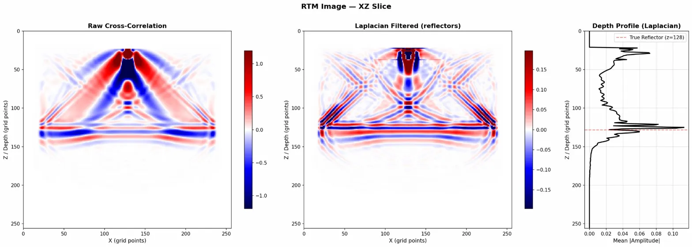

# Richter
**High-Performance GPU Seismic Wave Propagation Library**

A CUDA-optimized 3D Acoustic Wave Propagation engine built for Reverse Time Migration (RTM) and Full Waveform Inversion (FWI) workloads. Named after Charles F. Richter — because when it comes to seismic compute, magnitude matters.

Main Kernel is called Hello.cu, because its like a wave. Get it?



**Single-shot RTM correctly resolves synthetic reflector at z=128**

## Performance & Benchmarks

Grid: 512^3 | GPU: RTX 3070

| Implementation | GPts/s | Effective BW | % Peak BW |
|----------------|--------|-------------|-----------|
| Naive Kernel | 8.018 | 128.3 GB/s | 28.6% |
| SHMem 2.5D Tiling | 8.080 | 129.3 GB/s | 28.9% |
| **RegRot Sliding Window** | **16.5** | **264.9 GB/s** | **59.1%** |

**Register Rotation Performance Highlights:** 
- The kernel hits **~93% Hardware Bus Utilization** (416 GB/s), meaning the physical memory bandwidth is fully saturated. 
- The reported "59% Efficiency" reflects the **algorithmic overhead** of halo data transfers required by the stencil shape.
- Achieves a **2x Total Speedup** over the baseline naive implementations.

*Shared Memory 2.5D Tiling is roughly the same speed as the naive kernel because the L2 cache effectively buffers the naive access patterns, causing the explicit shared memory overhead to cancel out potential gains.*

## Building

```bash
mkdir build && cd build
cmake .. -DCMAKE_CUDA_ARCHITECTURES=86
cmake --build . --config Release
```

## Executables

The CMake build produces several targets:

- `benchmark`: Runs the core performance benchmark tests across the different kernel implementations.
  - Usage: `./build/benchmark [grid_size] [peak_bandwidth_gbs]`
- `runtests`: Executes unit tests to verify correctness.
  - Usage: `./build/runtests`
- `snapshot`: Runs a short simulation and dumps a 2D XY slice of the wavefield as `slice_xy.npy` to be visualized.
  - Usage: `./build/snapshot [grid_size] [num_timesteps]`
- `rtm_demo`: Runs an end-to-end Reverse Time Migration on synthetic data, exporting an `rtm_image.npy` file.
  - Usage: `./build/rtm_demo [grid_size] [num_timesteps] [checkpoint_interval]`
- `profile_register`: A standalone target specifically compiled with debug/line info, designed to be run through Nsight Compute (NCU) for profiling the Register Rotation kernel.

## Visualization Tools

Richter includes Python utilities to visualize the `.npy` files produced by the simulation executables.

### Viewing Simulation Slices
Use `view_slice.py` to visualize the wavefield slices generated by `snapshot`. This renders a symmetric pressure field indicating wave compression and rarefaction.

```bash
./build/snapshot 256 200
python tools/view_slice.py slice_xy.npy
```

### Viewing RTM Images
Use `view_rtm.py` to process and visualize the output from `rtm_demo`. This script applies a Laplacian filter to the raw cross-correlation image, which suppresses the low-frequency source artifacts and enhances the visibility of the reflectors. It also generates a 1D depth profile.

```bash
./build/rtm_demo 256
python tools/view_rtm.py rtm_image.npy
```


## Tech Stack

- **C++17 / CUDA 12** — Core compute
- **PyBind11** — Python interface
- **CMake** — Build system
